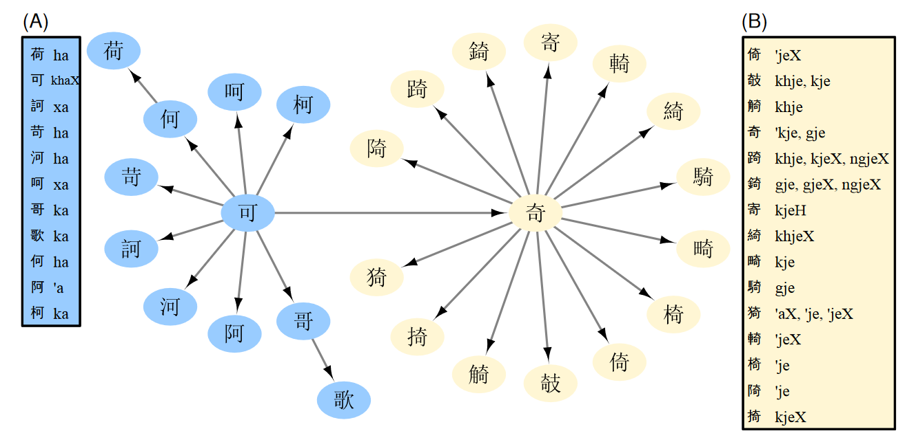

# 网络分析方法及其在古汉语研究中的应用综述

## 1. 网络分析的基本概念

　　**1.1** 简而言之，**网络**（network）是由线段连接在一起的点的集合，在物理学、生物学和社会学等领域中都有广泛的应用。下面简单地介绍一些基本概念，更多内容可以参见 Brandes & Erlebach（[2005](https://link.springer.com/book/10.1007/b106453)）、Bondy & Murty（[2013](https://www.springer.com/gp/book/9781846289699)）等专著。按照离散数学中图论（graph theory）的术语，各个点被称作**顶点**（vertices）或**结点**（nodes），而连接结点的线段（或弧线）称之为**边**（edges），如图所示（引自 Newman, [2010](https://www.oxfordscholarship.com/view/10.1093/acprof:oso/9780199206650.001.0001/acprof-9780199206650)）：

　　**1.2** 一个**网络图**（graph）可以用 $G = (V , E)$ 的形式来表示。图中，结点的集合记作 $V(G) = \{ v_1, v_2, v_3, \cdots, v_n \}$，边的集合记作 $E(G)=\{e_1, e_2, e_3, \cdots, e_n\}$。结点之间的关系称作关联函数，记作 $\psi_G (e)$。

　　网络图既可以是无方向的（undirected），也可以是有方向的（directed）。我们用 $D$ 表示有向图。

　　对于两个结点 $u,v \in V$ 所组成的边 $e$，可以直接写成 $u v$。在无向图中记作 $\psi_G(e)=\{u,v\}$；在有向图中则记作 $\psi_D(e)=(u,v)$，我们称其中的 $u$ 是 $e$ 的源（或头），$v$ 是 $e$ 的目标（或尾）。

　　**1.3** 在一个无向的网络图 $G$ 中，结点的**度**（degree）是指和结点 $v$ 相交的边的数量，记作 $d_G(v)$；结点度的最大值记作 $\Delta (G)$，最小值记作 $\delta (G)$。对有向图 $D$ 来说，还区分**入度**（indegree，即以 $v$ 为头的边的数目）和**出度**（outdegree，即以 $v$ 为头的边的数目），分别记作 $d_{D}^{-}$ 和 $d_{D}^{+}$。

## 2. 网络图的实现方法

　　**2.1** 通过计算机制作网络图的方法很多，主要有以下几类：

1. [Python](https://www.python.org/) 语言，需要配合 [NetworkX](http://networkx.github.io/) 和 [Matplotlib](https://matplotlib.org/) 等扩展包（package）；
2. [JavaScript](https://www.javascript.com) 脚本，较为流行的有 [Cola.js](https://ialab.it.monash.edu/webcola/)、[D3.js](https://d3js.org/)、[ECharts.js](http://echarts.baidu.com/)、[Gexf.js](https://github.com/raphv/gexf-js)、[Sigma.js](http://sigmajs.org/) 和 [Vis.js](https://visjs.org/) 等；
3. 其他网络分析及其可视化软件，如 [AllegroGraph](https://allegrograph.com/)、[Gephi](https://gephi.org/) 、[NetMiner](http://www.netminer.com/main/main-read.do) 等。

除此之外，还有 [R](https://www.r-project.org/) 语言等很多工具或软件也可以实现类似的效果，具体情况可以参见维基百科的 [en:Social network analysis software](https://en.wikipedia.org/wiki/Social_network_analysis_software) 词条。

　　由于篇幅所限，每种工具的使用用法也各不相同，因此这里不打算介绍的操作步骤，只是对上述这三种方式的优缺点进行简要的评述。

　　**2.2** 作为一门编程语言，Python 的使用需要安装相应的环境，而且所有设置都需要以编程命令的形式完成，因此相对而言直观性较差，安装、学习的成本较高。但也正得益于此，Python 具有更强的可定制性，加之其开源、活跃的社区，让使用者可以根据自己的实际需要灵活调整其配置，并直接编写相关程序以展开后续的数据分析工作。

　　通过 JavaScript 实现网络图制作与分析的脚本很多，选择丰富，其使用方式也不尽相同。总体说来，使用 JavaScript 同样要安装一定编程环境，还需要一些 HTML/CSS 的基础知识。但 JavaScript 作为一门 Web 编程语言，被广泛运用于几乎所有现代的 HTML 网页上，因此虽然其数据处理能力稍弱，但由于 JavaScript 不仅可以生成图片，更能够以可交互的形式应用在网页上，不受平台和软件格式的限制，十分便于结果的查看和共享。

　　网络分析软件一般有较为直观的图形化界面，可以方便地导入、管理、分析数据，相对来说最易于掌握。其中的 Gephi 更是以其跨平台、开源易用、功能强大的特点，成为最流行的网络分析软件之一；但缺点在于打开速度相对较慢，而且生成的结果必须在特定软件中查看才能有交互性。换言之，如果结点和边的数据比较繁多，静态的图片格式不能清晰地反映结点及其相互的关系。

　　**2.3** 通过上述分析，我们认为较好的解决方案是：用 Gephi 软件将原始数据制作成网络图，再将结果生成为 `.gexf` 或 `.json` 格式（而非默认配置下直接保存得到的 `.gephi` 文件）。这样，我们可以在 JavaScript 中直接调用网络图的数据文件制作 HTML 文档，或是直接显示在 [Observable](https://observablehq.com/) 等在线平台上，以便查看网络图的结果。

## 3. 网络分析与音韵学研究

　　目前，网络分析方法在音韵学，特别是上古音领域的应用较为广泛。但首先需要说明的是：从现有的成果来看，网络分析并不是一种新的「研究方法」，只是在传统研究方法的基础上，帮助我们认识、分析材料（或数据）的一种手段。因此，我们按照耿振生（2004）对音韵学研究方法的总结，分别加以叙述。

### 3.1. 韵脚字归纳法

　　游函（List, [2016a](https://doi.org/10.1163/2405478X-00902004)）最早用网络分析方法系联了《诗经》押韵。

### 3.2. 反切系联法

　　游函（List, [2018](https://hal.archives-ouvertes.fr/hal-01706927v2/document)）利用网络分析方法对《广韵》中反切上字的分组现象作了考察。

　　**3.2.2** 胡佳佳（[2018](http://kns.cnki.net/KCMS/detail/detail.aspx?dbname=cjfd2018&filename=lyyy201802013&dbcode=cjfq)）从实际教学的角度出发，介绍了网络分析方法和 Gephi 软件在系联反切上字和下字时的作用。

　　胡文系联反切下字的方法是，先找出一个韵内所有反切下字（我们记作 $V_1$），再查出这些字所在小韵的反切下字（我们记作 $V_2$）。显然 $V_2 \in V_1$，又因为「反切下字之间的韵类等价关系是双向的，所以网络图中的边是无方向的」，就可以建立关联函数 $\psi_G(e)=\{V_1, V_2\}$。以五支韵为例，其结果如下所示：

<iframe id="anychart-iframe-embed-samples-network-graph" src="about:blank" frameBorder="0" class="anychart-embed anychart-embed-samples-network-graph"></iframe>

### 3.3. 谐声推演法

　　我们知道，形声字中包含着丰富的古音信息，为上古音研究提供了重要线索；但同时其信息又是十分复杂的，需要仔细甄别，特别是在声母方面，更是「言人人殊」，必须要持谨慎态度（耿振生, 2004: §3）。网络分析方法的直观性，可以为我们更准确地认识谐声系统提供很多帮助。西方学者游函和丘内藤在这方面做出了初步的尝试。

　　**3.3.1** 游函（List, [2018](https://hal.archives-ouvertes.fr/hal-01706927v2/document): §2.1）利用有向图，分析了谐声系列与三等/非三等的关系。

　　蒲立本把上古汉语的音节分成两类，A 类是中古的非三等，B 类是中古的三等，有前腭介音 -*j*-。沙加尔（Sagart, [1999](https://doi.org/10.1075/cilt.184): §§2.7, 3.3.2）认为这两种类型和谐声系列有关。比如，在下图（引自 List, [2018](https://hal.archives-ouvertes.fr/hal-01706927v2/document): 7）中，蓝色的结点属于 A 类，黄色的结点属于 B 类：

　　游函利用 Python 语言，分析了高本汉（Karlgren, [1957](http://ss.zhizhen.com/detail_38502727e7500f26f1ce104a15568ce8e2ee8db6d8d18d4d1921b0a3ea255101ff20232bc5d7271392ca6eb2c71318865155c5438fbb21eab02f26b59238cf601ee603dc6f3d002408283ada86f7e698?)）归纳的 625 组谐声系列。如果某一组类中超过 70% 的字属于中古的三等，那么就归入上古的 B 类；反之，如果不到 30% 的字属于中古三等，则将其归入上古的 A 类。在这样的条件下，游函找到了 16 组谐声偏旁符合这一规律（见原文附录 B），并指出其中 8 组是「十分显著」的例子。

　　**3.3.2** 游函、丘内藤（List & Hill, [待刊](http://lingulist.de/documents/papers/hill-list-2019-chinese-character-formation-graphs.pdf)）

### 3.4 古音构拟的检验

## 4. 网络分析方法的其他运用

　　目前，网络分析方法在其他领域中的应用还比较有限。北京师范大学汉字研究与现代应用实验室制作的汉字全息资源应用系统（[2019](http://qxk.bnu.edu.cn/)，以下简称「全息库」），为我们展示了一个很好的思路。

　　全息库在「专书检索」选项卡「综合系联」中的「训释系联」里，使用了 JavaScript 的 [vis.js](https://github.com/visjs/vis-network) 插件，实现了《说文》《尔雅》《释名》《方言》四本最为重要的小学专书中训释词和被训释词的自动系联，其效果如图所示：

不难看出，在左侧的菜单里可以自行设定被释词或训释词，并选择系联的范围和层级（最小为 1，最大为 5）。无疑，这一系统对我们更好地认识、分析词义系统是很有帮助的。但遗憾的是，全息库中的「构型系联」和「古音系联」都只是线性的列表，没有采用网络分析这一形式。

## 5. 结语

## 参考文献

- 北京师范大学汉字研究与现代应用实验室 （2019）[汉字全息资源应用系统](http://qxk.bnu.edu.cn/)。访问日期：2019 年 8 月 4 日。
- 耿振生 （2004） 《20 世纪汉语音韵学方法论》，北京大学出版社。
- 胡佳佳 （2018） [网络分析方法在音韵学教学中的应用——以《广韵》反切系联为例](http://kns.cnki.net/KCMS/detail/detail.aspx?dbname=cjfd2018&filename=lyyy201802013&dbcode=cjfq)，《励耘语言学刊》第 2 期，155-165 页。
- Bondy, John A. & Murty, Uppaluri S.R. (2013): [Graph Theory](https://www.springer.com/gp/book/9781846289699). 3rd ed. Berlin, Heidelberg: Springer-Verlag. 第一版汉译本见 J.A. 邦迪、U.S.R. 默蒂：《图论及其应用》，吴望名译，科学出版社，1984。
- Brandes, Ulrik & Erlebach Thomas eds. (2005): [*Network Analysis: Methodological Foundations*](https://link.springer.com/book/10.1007/b106453). Berlin, Heidelberg: Springer-Verlag.
- Hill, Nathan W. & List, Johann-Mattis (forthcoming): [Using Chinese character formation graphs to test proposals in Chinese historical phonology](http://lingulist.de/documents/papers/hill-list-2019-chinese-character-formation-graphs.pdf). *Bulletin of Chinese Linguistics*, 1-16.
- Karlgren, Bernhard (1957): [Gramma Serica Recensa](http://ss.zhizhen.com/detail_38502727e7500f26f1ce104a15568ce8e2ee8db6d8d18d4d1921b0a3ea255101ff20232bc5d7271392ca6eb2c71318865155c5438fbb21eab02f26b59238cf601ee603dc6f3d002408283ada86f7e698?). *Bulletin of the Museum of Far Eastern Antiquities*, 29. 汉译本见高本汉：《[汉文典](http://ss.zhizhen.com/detail_38502727e7500f26ea2dfaed11771665fed4b47e2deecb0f1921b0a3ea25510134114c969f2eae5cc744720e3130b751ed88dfe5746c33d69cb51d43696fa7ef69b6d1a0a8fc4207fba42c3daf60db7d?&apistrclassfy=0_8_2)》，潘悟云、杨剑桥、陈重业、张洪明译，上海辞书出版社，1997。
- List, Johann-Mattis (2016a): [Using Network Models to Analyze Old Chinese Rhyme Data](https://doi.org/10.1163/2405478X-00902004). *Bulletin of Chinese Linguistics*, 9(2), 218-241.
- —— (2016b). digling/shijing: Data and Code for the Shījīng Network Analysis (Version v1.0). Zenodo. http://doi.org/10.5281/zenodo.167341.
- —— (2018): [More on network approaches in Historical Chinese Phonology](https://hal.archives-ouvertes.fr/hal-01706927v2/document). Paper prepared for the LFK Society Young Scholars Symposium. Taipei: Li Fang-Kuei Society for Chinese Linguistics.
- Newman, Mark E.J. (2010): [*Networks: an Introduction*](https://www.oxfordscholarship.com/view/10.1093/acprof:oso/9780199206650.001.0001/acprof-9780199206650). New York: Oxford University Press.
- Sagart, Laurent (1999): [*The Roots of Old Chinese*](https://doi.org/10.1075/cilt.184). Philadelphia: John Benjamins. 汉译本见沙加尔：《[上古汉语词根](http://ss.zhizhen.com/detail_38502727e7500f264b1a17c7914b5b8eb7d8e42d1448219a1921b0a3ea25510134114c969f2eae5cd8a964fdd6ecd3537ea0d09aa8e546031ebd9f0dd9d277dcf3cd01ab5af9a03019ea194ccb5b9f2e?&apistrclassfy=0_8_2)》，龚群虎译，上海教育出版社，2004。