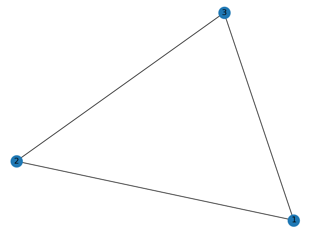

# 用 Python 进行网络分析

　　[Python](https://www.python.org/) 是一种计算机程序设计语言，以其简单易学、功能强大的特点，得到了十分广泛的应用。可以通过 [Matplotlib]((https://matplotlib.org/))（Hunter, [2007](https://doi.org/10.1109/MCSE.2007.55)）和 [NetworkX](https://networkx.github.io/)（Hagberg *et al.*, [2008](conference.scipy.org/proceedings/SciPy2008/paper_2/)）两个扩展包进行网络图的制作和分析。

## 1. 准备工作

　　**1.1** 首先，从[官方网站](https://www.python.org/downloads/release/python-374/)上下载最新版的 Python（目前最新的版本是 3.7.4，Windows 系统建议选择下载 `Windows x86-64 executable installer`）。运行安装程序时注意确定勾选以下项目：

```markdown
[x] Add Python 3.7 to PATH
[x] pip
    Installs pip, which can download and install other Python packages.
```

　　然后打开命令提示符窗口（Win + R 调出「运行」窗口，然后输入 `cmd.exe`），在窗口中输入 `python` 并单击回车，如果出现：

```powershell
$ python
Python 3.7.4 (tags/v3.7.4:e09359112e, ...) [MSC v... 64 bit (AMD64)] on win32
Type "help", "copyright", "credits" or "license" for more information.
```

就说明安装成功，已经可以开始使用了。（这里用 `$` 代替前面显示的路径，不需要手动输入。）

要退出 Python 环境，只需输入：

````python
exit()
````

就可以回到命令提示符了。除了这种方式之外，也可以直接打开 `Python 3.7 (64-bit).exe` 可执行文件进入 Python 环境，但退出后会直接关闭窗口。

　　我们可以尝试在 Python 环境中写一个小命令：

```python
>>> print('hello, world') #打印引号中的内容
```

并单击回车，就可以在下一行显示出「hello, world」的字样了。（在 Python 语言中，井号 `#` 后的内容是注释，只是为了便于我们了解代码的内容，不会被计算机识别、执行。）

　　**1.2** 在命令提示符中编程，好处是每一步都能直接看到结果，但却不能保存，每次运行时都要重新输入一遍，效率比较低。因此我们还需要一个文本编辑器，常用的有 [Notepad++](https://notepad-plus-plus.org/)、[Sublime Text](www.sublimetext.com/)、[Atom](www.atom.io/) 和 [Visual Studio Code](https://code.visualstudio.com/) 等等，可以任选其一。在编辑器中完成开发后，保存为 `xxx.py` 格式，然后在命令行中输入：

```powershell
$ python xxx.py
```

就可以直接打开运行。注意：不能使用 Word 或系统自带的记事本，因为这两者都不是纯文本编辑器，会加入一些其他信息导致程序运行错误。另外，如果 `.py` 文件不在命令行显示的路径（默认是 `C:\Users\用户名`）中，要先输入 `cd` 加上文件保存的路径并回车后，再输入上述命令才能运行。

　　**1.3** 我们先安装 NetworkX 扩展包，用来制作和分析网络模型。在命令提示符中输入 `exit()` 暂时退出 Python 环境，然后输入：

```powershell
$ pip install networkx
```

就可以利用 Python 自带的模块管理工具 pip 安装了。如果显示：

```powershell
Successfully installed decorator-4.4.0 networkx-2.
```

就说明已经安装成功了。

　　然后，用同样的方式安装数据可视化工具 [Matplotlib](https://matplotlib.org/)，将网络分析的结果可视化。在命令提示符中输入：

```powershell
$ pip install matplotlib
```

等待安装完成即可。

　　**1.4** 目前为止，准备工作就已经基本完成了。下面我们开始用 Python 绘制网络图。

## 2. 开始绘图

　　**2.1** 在编辑器中新建一个 `.py` 格式的文件。首先调用刚才安装的两个扩展包：

```python
import networkx as nx
import matplotlib.pyplot as plt
```

然后输入下列命令之一，以创建一个空白的网络图 `G`：

```python
G = nx.Graph() #无向图，或
G = nx.DiGraph() #有向图，或
G = nx.MultiGraph() #多重无向图，或
G = nx.MultiDigraph() #多重有向图，或
G.clear() #清空图
```

　　**2.2** 接下来，输入：

```python
nx.draw(G)
```

再调用 Matplotlib 扩展包，选择生成图片或直接保存到指定路径：

````python
plt.show() #生成网络图，或
plt.savefig("graph.png") #保存为graph.png
````

保存后运行这个程序（见 §1.2），稍等片刻后就可以得到一张空白的网络图了。

## 3. 结点

　　结点可以逐个添加或批量添加：

```python
G.add_node('n') #添加结点n，或
G.add_nodes_from('u','v') #添加结点u、结点v，或
G.add_nodes_from([1,4]) #添加结点1、结点2、结点3、结点4
```

如果要删除结点，则：

```python
G.remove_node('n') #删除结点n，或
G.remove_nodes_from('u','v') #删除结点u、结点v
```

## 4. 边

　　边的添加有两种方式，既可以像结点一样直接添加：

```python
G.add_edge('u','v') #添加边uv，或
G.add_edges_from([('u','v'),('p','q')]) #添加边uv、边pq
```

也可以先定义一条边 $u v$，再作为一个整体添加：

```python
e=(u,v)
G.add_edge(*e)
```

删除边的命令和结点一样，只要把 `add` 替换成 `remove`：

```python
G.remove_edge('a','b') #删除边ab，或
G.remove_edges_from([('a','b'),('c','d')]) #删除边ab、边cd
```

## 5. 实例

　　至此为止，我们就可以得到一幅基本的网络图，更多功能可以参见[官方文档](https://networkx.github.io/documentation/stable/tutorial.html)。下面是一个简单的例子：



附源代码：

```python
import networkx as nx
import matplotlib.pyplot as plt
G = nx.Graph()
G.add_nodes_from([1, 3])
G.add_edges_from([(1, 2), (1, 3), (2, 3)])
nx.draw(G, with_labels=True)
plt.show()
```


## 参考文献

- 廖雪峰：《Python 教程》，https://www.liaoxuefeng.com/wiki/1016959663602400
- Hagberg, Aric A., Schult, Daniel A. & Swart, Pieter J. (2008): [Exploring Network Structure, Dynamics, and Function Using NetworkX](conference.scipy.org/proceedings/SciPy2008/paper_2/). In Gäel Varoquaux, Travis Vaught, and Jarrod Millman (eds). [*Proceedings of the 7th Python in Science Conference (SciPy2008, Pasadena, CA)*](http://conference.scipy.org/proceedings/SciPy2008/index.html): 11-15.
- Hunter, John D. (2007): [Matplotlib: A 2D Graphics Environment](https://doi.org/10.1109/MCSE.2007.55). *Computing in Science & Engineering*, 9, (3): 90-95.